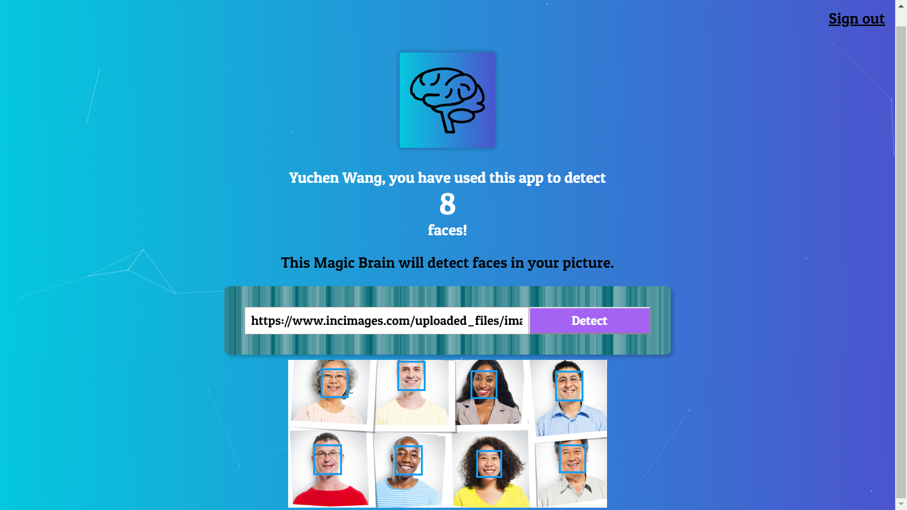
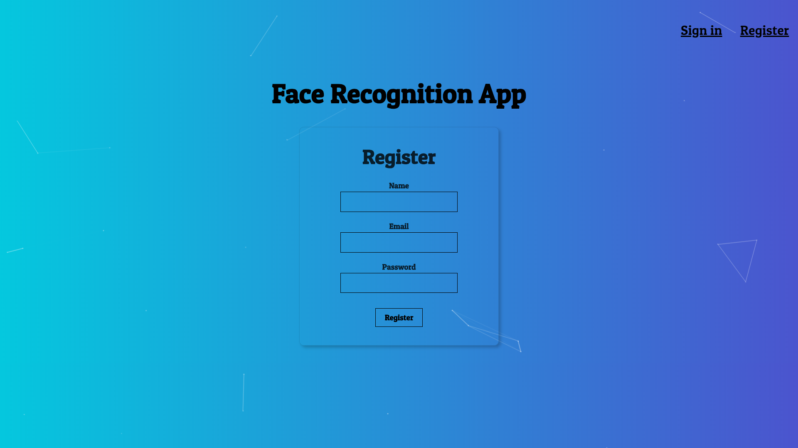
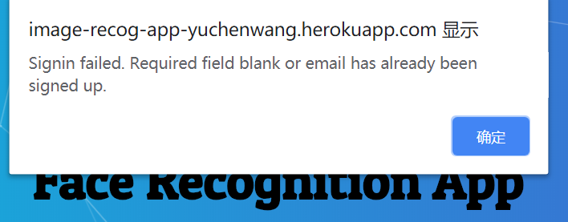
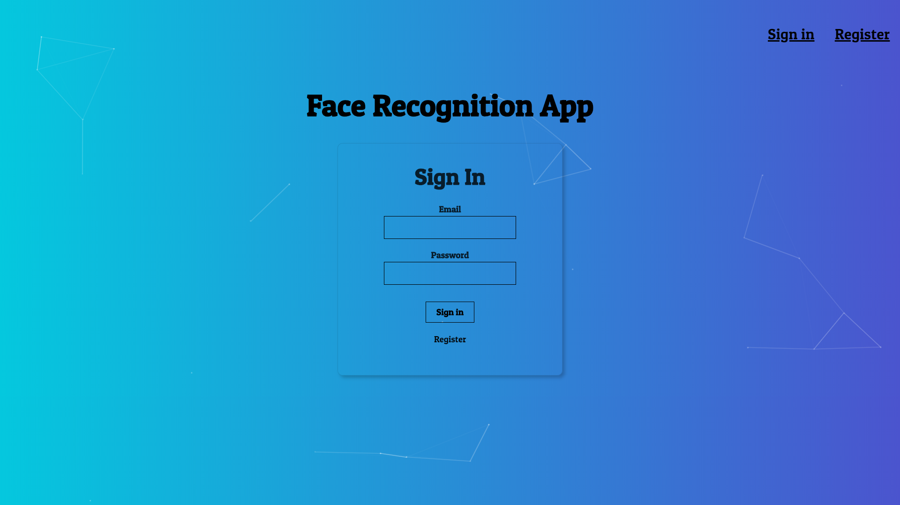
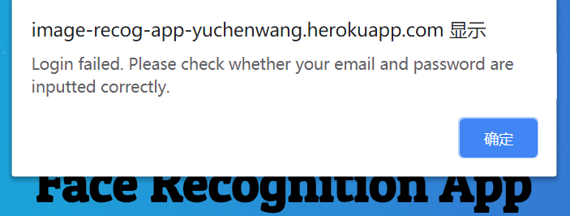

# Face Recognition App: A NodeJS and Express based Back End

https://image-recog-app-yuchenwang.herokuapp.com/

**Attention**: If you have trouble opening this web page, please refresh the page to try again since heroku apps hibernate if there is no traffic for a certain time.

Welcome to check my **front end** repo [**here**](https://github.com/Yuchen-Wang-SH/Face_Recognition_App_frontend).

## The App

### Usage
- Copy the URL of an image and paste it into the text box;
- Click **Detect**;
- You should see all (or most of) the faces in the image detected and surrounded by boxes.
  - Meanwhile, the count of faces you have detected using this app is accumulated and stored in a PostgreSQL database, and displayed as the number above.
- Even if you log out and log back in, you  still have your count maintained and ready to be accumulated.

## Register

If the email has been registered or any blank has been detected, an `alert` will pop up in the browser:

Or, you are successfully registered and automatically logged in.

## Sign In

If your email and password do not pass the authentication, an `alert` will pop up in the browser:

Or you will successfully log in.
